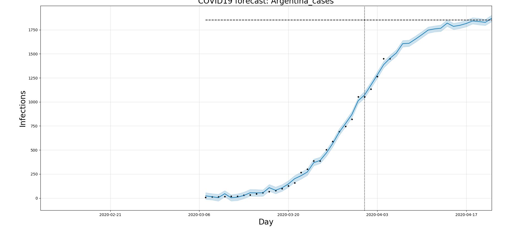

# COVID-19 Growth Modeling and Forecasting with Prophet over the Argentina data

Based on all countries COVID-19 data fetched through REST, we model virus growth with logistic function and run forecast with Prophet library in Python using the Argentina data fetched.

## Why Logistic Growth

The reason to use Logistic Growth for modeling the Coronavirus outbreak is that epidemiologists have studied those types of outbreaks and it is well known that the first period of an epidemic follows Exponential Growth and that the total period can be modeled with a Logistic Growth.

## Checking results

- Upper range: ~1800
- Expected stabilization period: by end of April

> Keep in mind this is a forecast, it is based on today's actual numbers, with next day data it can be adjusted. Black dots — actual data, blue line — forecast. Vertical black line — last day available with actual data. Horizontal black line — estimated top number of infections.

*Based on the Medium post:* https://towardsdatascience.com/covid-19-growth-modeling-and-forecasting-with-prophet-2ff5ebd00c01
